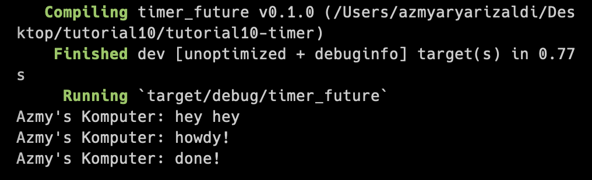
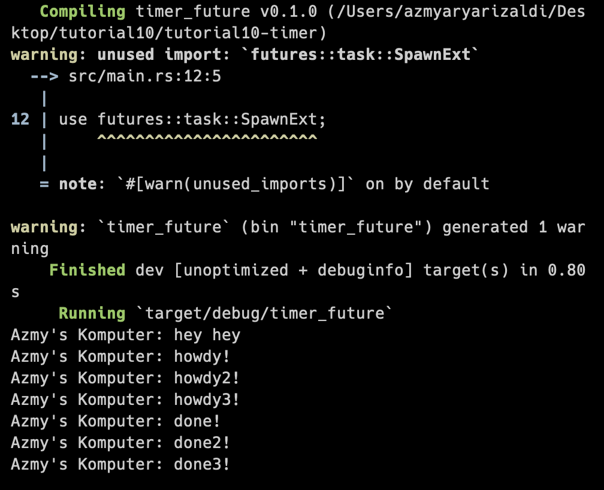
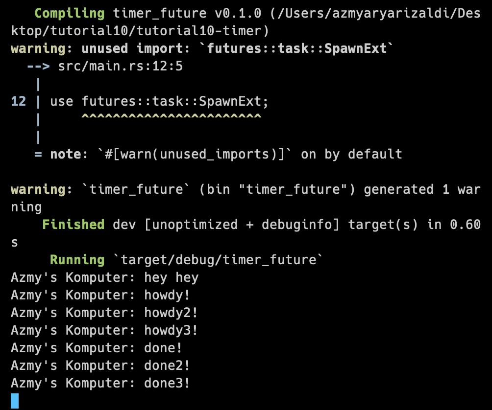

# Module 10
> M Azmy Arya Rizaldi M - 2206081704

## Understanding How it Works

The async function operates independently of the main execution flow, allowing the main program to proceed without waiting for the async function to finish. Thus, hey hey is printed outside the async function and immediately executed by the main program, while the async function awaits the future's result. This results in hey hey being printed before the async task is executed by the executor. Thats why the message hey hey gets printed before howdy!

## Multiple Spawn

### With `drop(spawner);` statement:

 The spawns are running concurrently. All three tasks can run simultaneously without waiting for each other, so there's no guarantee that tasks will finish in the same order as the code sequence. We can see that the string done! appears after the string done2! even though in the code their order is reversed.

### Without `drop(spawner);` statement:

drop(spawner) is needed to indicate that we have finished using spawner. spawner behaves like a message queue. When we spawn something, it gets added to the queue. As the executor runs, messages are taken from the queue. By calling drop(spawner), we signal that we've finished sending messages to the queue, allowing the executor to complete any remaining tasks and ultimately terminate the program.

